# CraveFlow

[](https://expo.dev/)
[](https://reactnative.dev/)
[](https://www.typescriptlang.org/)
[](https://docs.expo.dev/router/introduction/)
[](#theming)

CraveFlow is a polished food delivery and restaurant booking mobile app built in Expo Router and React Native. It reconstructs the supplied food-ordering screenshots into a complete product experience with onboarding, auth, search, favorites, cart, checkout, orders, live tracking, bookings, profile management, support screens, and a full light/dark theme system.

## Why This App Exists

The original brief was screenshot-driven, but the goal was not a static UI clone. This project turns those references into a realistic app flow with reusable design primitives, persistent mock state, believable seeded content, and production-minded UX details such as empty states, validation, protected navigation, live map tracking, and manual theme switching.

## Table of Contents

- [Feature Overview](#feature-overview)
- [Screenshots](#screenshots)
- [Tech Stack](#tech-stack)
- [Architecture Overview](#architecture-overview)
- [Theming](#theming)
- [Getting Started](#getting-started)
- [Project Structure](#project-structure)
- [Production Readiness Notes](#production-readiness-notes)
- [Troubleshooting](#troubleshooting)
- [Future Improvements](#future-improvements)
- [Credits](#credits)

## Feature Overview

### Discovery and ordering

- Screenshot-matched home feed with promotional hero cards, categories, popular dishes, and nearby restaurants
- Explore and search flows with category filtering, deep-linkable prefilled search queries, and a no-results empty state
- Product detail pages with gallery thumbnails, size selection, add-ons, quantity controls, pricing updates, and add-to-cart flow
- Restaurant detail pages with booking CTA, order CTA, metadata, and dish catalog
- Cart, coupon application, checkout summary, address selection, payment selection, and order placement

### Delivery and reservations

- Active, completed, and cancelled order history
- Live order tracking with React Native Maps, route overlays, courier marker, pickup/dropoff markers, ETA card, and support actions
- Reservation flow with booking creation, reminder toggles, and cancellation
- Coupon and notification centers reconstructed from the provided references

### Account and settings

- Welcome, onboarding, sign-in, sign-up, and forgot-password screens
- Profile hub with editing, order shortcuts, booking shortcuts, address management, and payment methods
- Settings with manual `System`, `Light`, and `Dark` theme override
- Help Center, legal/privacy overview, and app/about screens

### UX and state coverage

- System-safe layout primitives with safe areas and keyboard-aware forms
- Validation with React Hook Form + Zod
- Empty states for search, cart/checkout flows, favorites/orders/bookings when applicable
- Persistent local app state via AsyncStorage hydration
- Reusable card system, typography scale, spacing tokens, and shared controls

## Screenshots

The repo includes a larger capture set in [`docs/screenshots`](./docs/screenshots). Below is the curated GitHub gallery covering both light and dark themes plus key long-form flows.

### Launch and auth

<p>
  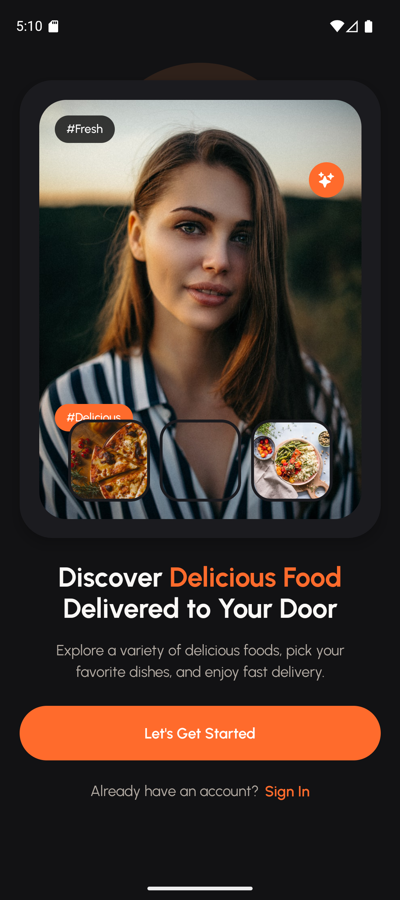
  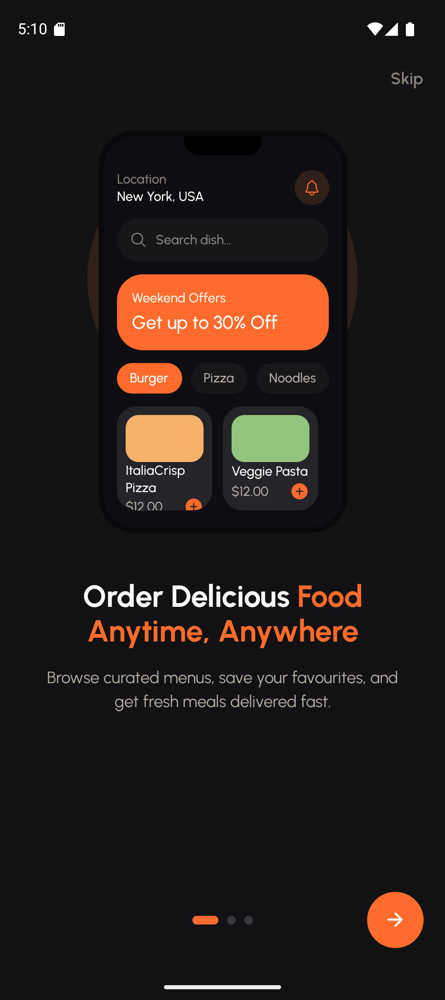
  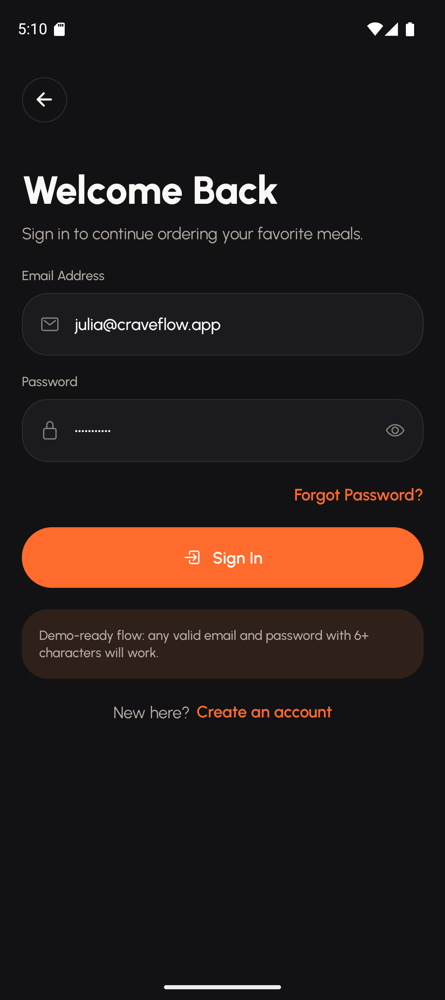
  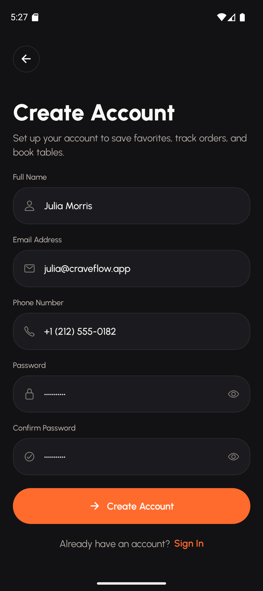
</p>

### Core browsing flow

<p>
  
  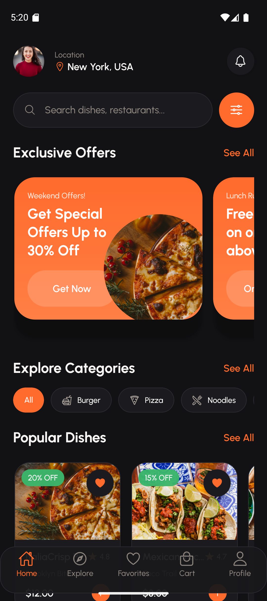
  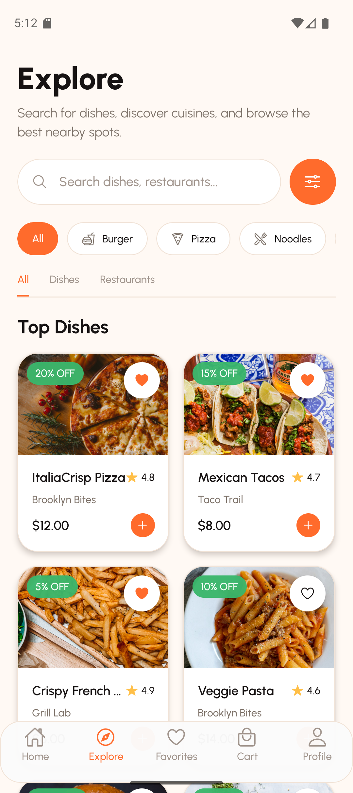
  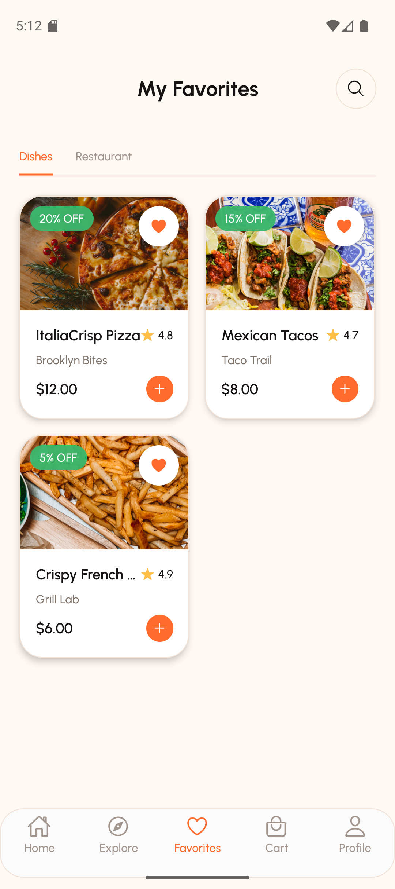
</p>

### Search, detail, and tracking

<p>
  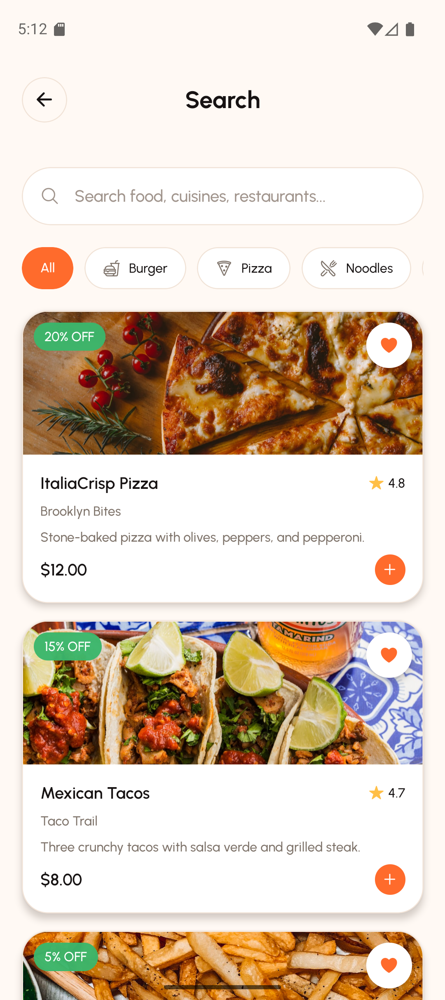
  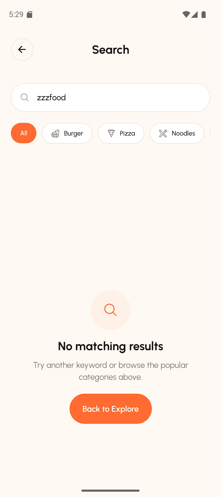
  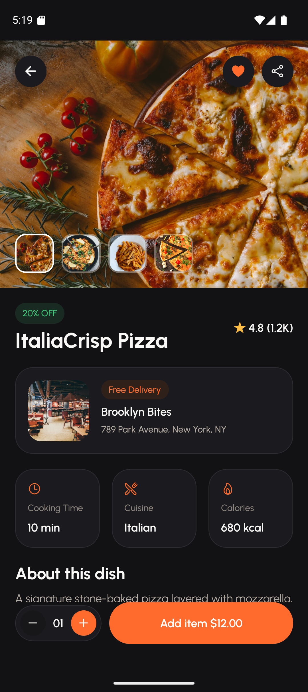
  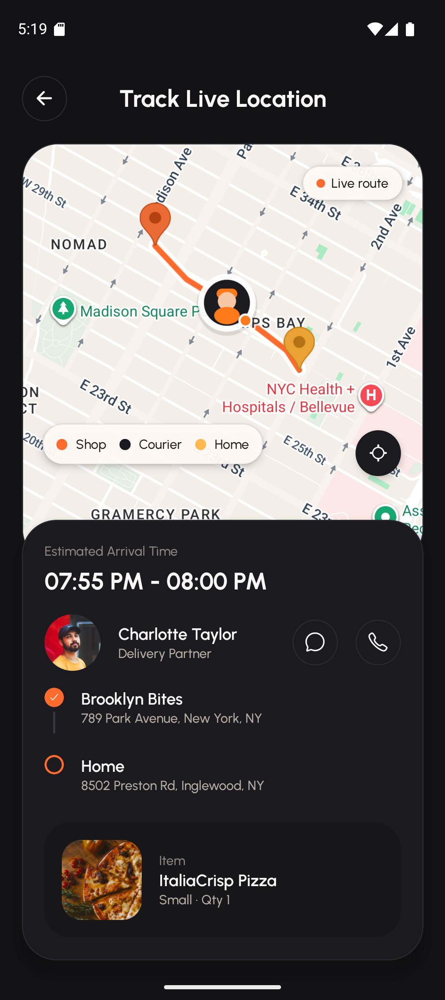
</p>

### Orders, profile, and settings

<p>
  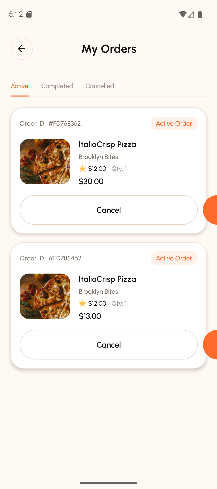
  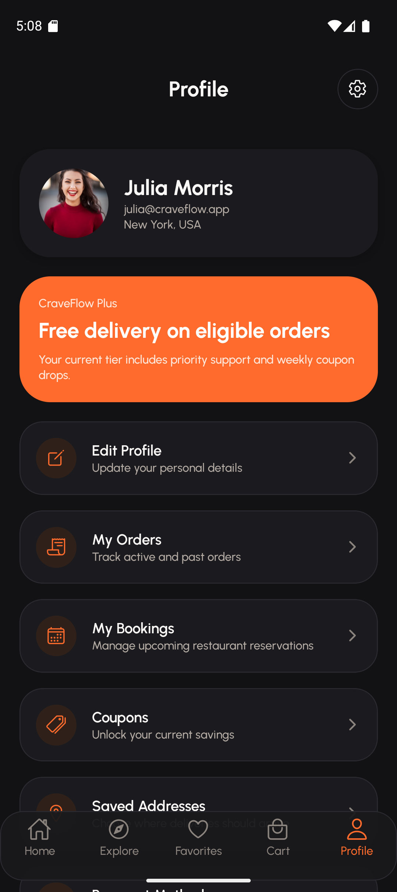
  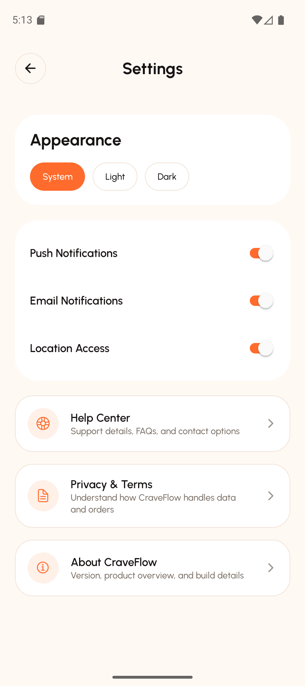
  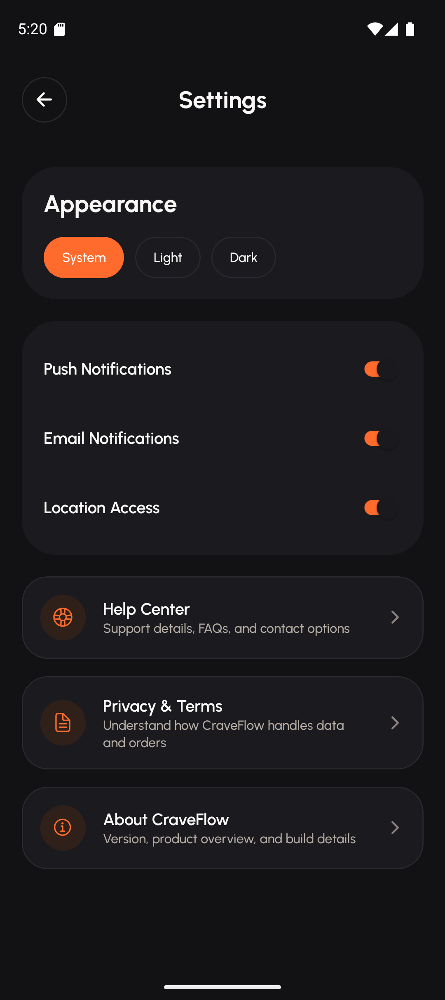
</p>

### Long-form captures

#### Home feed

<p>
  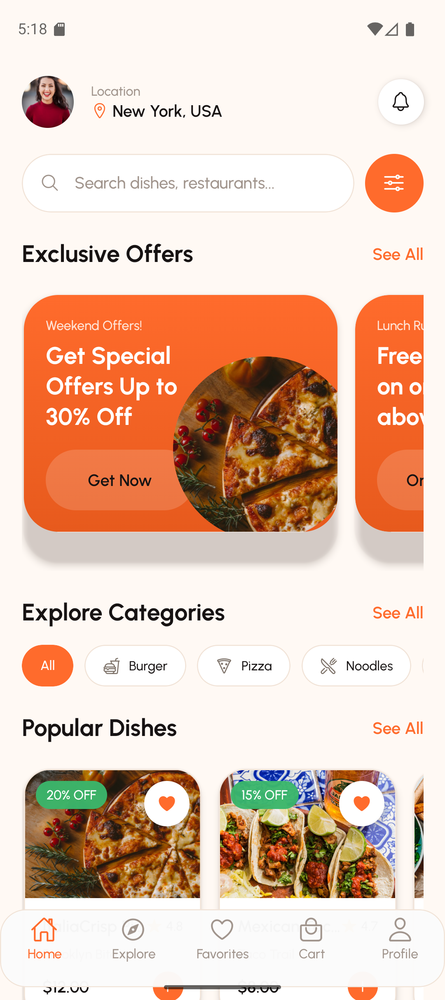
  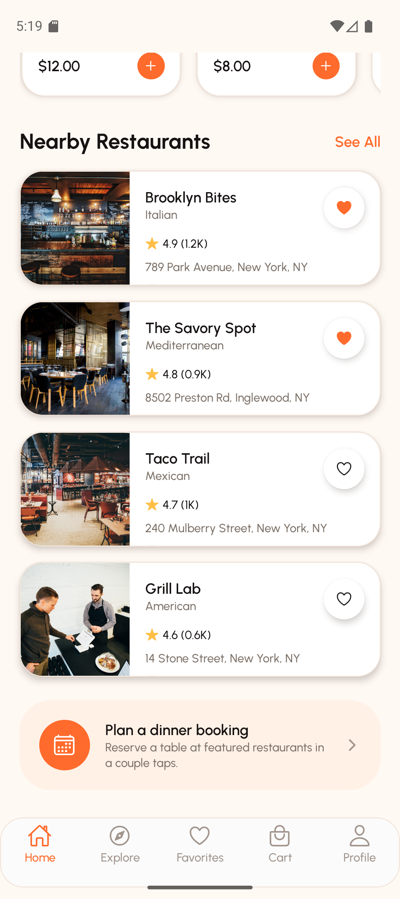
</p>

#### Product detail

<p>
  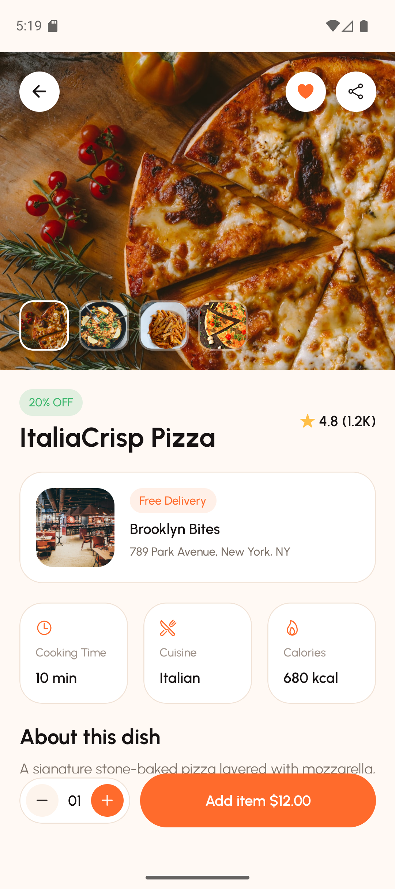
  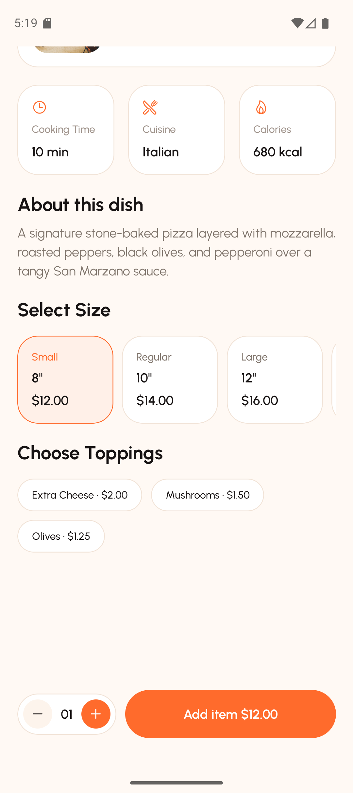
</p>

#### Restaurant detail

<p>
  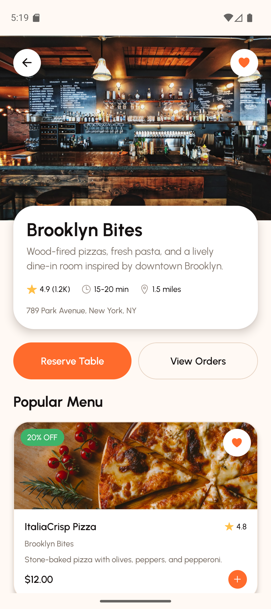
  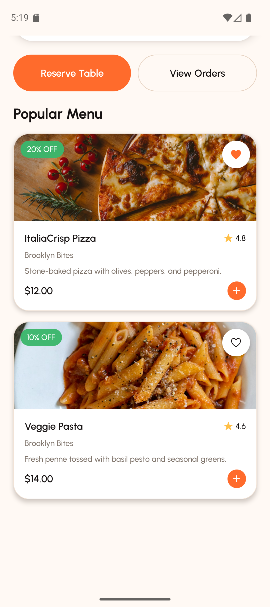
</p>

#### Cart and checkout handoff

<p>
  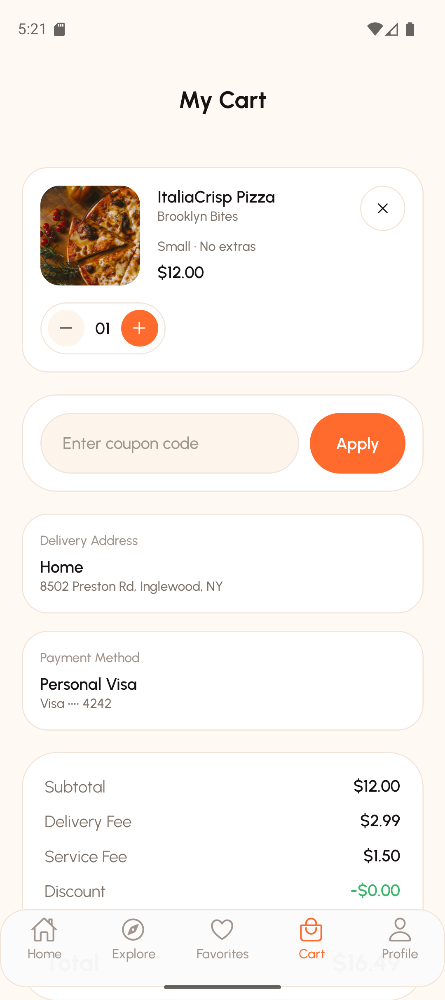
  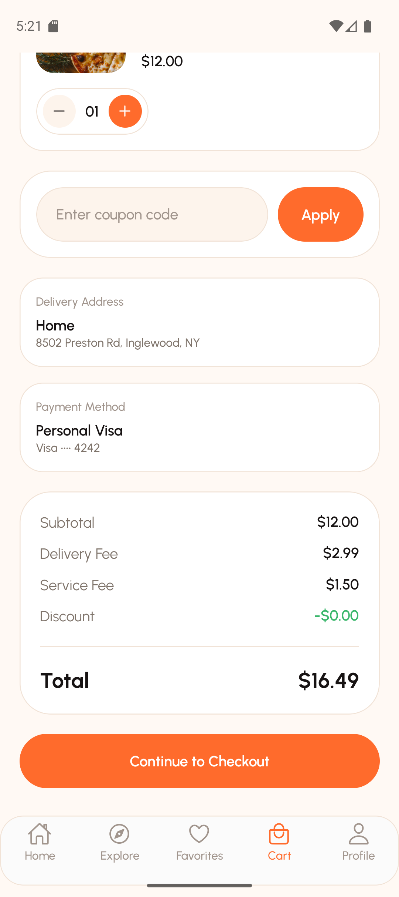
</p>

Additional supporting screens captured in the repo:

- [`about-light.png`](./docs/screenshots/about-light.png)
- [`bookings-light.png`](./docs/screenshots/bookings-light.png)
- [`coupons-light.png`](./docs/screenshots/coupons-light.png)
- [`forgot-password-dark.png`](./docs/screenshots/forgot-password-dark.png)
- [`help-light.png`](./docs/screenshots/help-light.png)
- [`legal-light.png`](./docs/screenshots/legal-light.png)
- [`notifications-light.png`](./docs/screenshots/notifications-light.png)
- [`product-light.png`](./docs/screenshots/product-light.png)
- [`restaurant-light.png`](./docs/screenshots/restaurant-light.png)
- [`track-light.png`](./docs/screenshots/track-light.png)

## Tech Stack

### Mobile app

- Expo SDK 54
- React Native 0.81
- React 19
- Expo Router for file-based navigation
- TypeScript in strict mode

### UI and theming

- Custom theme tokens in [`theme/tokens.ts`](./theme/tokens.ts)
- Urbanist via `@expo-google-fonts/urbanist`
- `expo-image` for optimized imagery
- `expo-status-bar` and `expo-system-ui` for theme-aware system chrome

### State and validation

- Context-based app store in [`providers/app-provider.tsx`](./providers/app-provider.tsx)
- AsyncStorage persistence for hydration and session/settings continuity
- React Hook Form + Zod for forms and validation

### Navigation and device features

- Expo Router protected auth/app stacks
- React Navigation theming bridge
- `react-native-safe-area-context`
- `react-native-maps` for live tracking maps

### Quality tooling

- `expo lint`
- `vitest`
- `npx tsc --noEmit`
- Screenshot helper script in [`scripts/capture-android-screen.ps1`](./scripts/capture-android-screen.ps1)

## Architecture Overview

### App shell and navigation

- [`app/_layout.tsx`](./app/_layout.tsx) loads fonts, controls the splash screen, sets system background color, and mounts the theme-aware root stack.
- [`app/(auth)`](./app/%28auth%29) contains welcome, onboarding, sign-in, sign-up, and forgot-password flows.
- [`app/(app)`](./app/%28app%29) contains the authenticated stack: tabs, detail pages, search, checkout, tracking, settings, account management, and support screens.
- [`app/(app)/(tabs)`](./app/%28app%29/%28tabs%29) holds the primary tab experience: home, explore, favorites, cart, and profile.

### Data flow

- [`data/mock-data.ts`](./data/mock-data.ts) seeds dishes, restaurants, coupons, bookings, notifications, payment methods, addresses, and tracking coordinates.
- [`providers/app-provider.tsx`](./providers/app-provider.tsx) hydrates the app state from AsyncStorage, merges persisted state with seed defaults, and exposes all product actions through a typed context API.
- [`lib/selectors.ts`](./lib/selectors.ts) centralizes derived state like cart summaries, grouped orders, and search results.

### Design system

- [`theme/tokens.ts`](./theme/tokens.ts) defines light/dark color palettes, typography scale, spacing, radii, elevation, and navigation theme bridging.
- [`hooks/use-app-theme.ts`](./hooks/use-app-theme.ts) resolves `system`, `light`, and `dark` theme mode into concrete tokens.
- [`components/ui`](./components/ui) contains reusable controls such as buttons, chips, icon buttons, quantity steppers, segmented controls, and search bars.
- [`components/cards`](./components/cards) packages recurring product, restaurant, order, booking, profile, and menu row patterns.

### Mock backend strategy

The app currently uses a realistic local state model rather than a live API. That choice keeps the experience fully runnable offline while still preserving production-ready seams:

- selectors isolate derived data logic
- provider actions mirror future service operations
- seeded entities already carry IDs, relationships, and order/booking snapshots
- search now supports deep-linked initial queries, which is useful for future notifications or campaigns

Swapping in a real backend can happen incrementally by replacing provider internals with async service calls while keeping the screen layer intact.

## Theming

CraveFlow treats theming as a first-class feature, not a cosmetic toggle.

- Light, dark, and system modes are supported end to end.
- Theme mode is user-configurable from the Settings screen.
- Tokens cover backgrounds, surfaces, cards, borders, text, status colors, and shadow behavior.
- Navigation chrome, map overlays, form fields, buttons, cards, tabs, and empty states have theme-aware styling.
- System status bar and Android background color are synchronized with the active theme.

To extend the theme:

1. Add new color or spacing tokens in [`theme/tokens.ts`](./theme/tokens.ts).
2. Consume them through [`hooks/use-app-theme.ts`](./hooks/use-app-theme.ts).
3. Use themed primitives in `components/ui` or screen-level styles rather than hardcoding raw colors.

## Getting Started

### Prerequisites

- Node.js 20+
- npm 10+
- Android Studio with an Android emulator, or a physical Android device
- Expo Go installed on the emulator/device

### Install dependencies

```bash
npm install
```

### Run the app

```bash
npx expo start --go --localhost
```

From the Expo CLI:

- press `a` to open Android
- or run `npm run android`

### Run on the Android emulator

1. Start an Android emulator from Android Studio.
2. Start Metro:

   ```bash
   npx expo start --go --localhost
   ```

3. If Expo Go does not connect automatically, reverse the Metro port:

   ```bash
   adb reverse tcp:8081 tcp:8081
   ```

4. Launch Expo Go or run:

   ```bash
   npm run android
   ```

### Quality checks

```bash
npm test
npx tsc --noEmit
npm run lint
```

### Screenshot helper

The repo includes a repeatable Android capture utility for QA and README assets:

```powershell
powershell -ExecutionPolicy Bypass -File scripts\capture-android-screen.ps1 `
  -Serial emulator-5554 `
  -Route '/search?q=zzzfood' `
  -Output 'docs\screenshots\search-empty-light.png'
```

## Project Structure

```text
app/
  _layout.tsx               Root fonts, splash, navigation theme
  index.tsx                 Entry redirect
  (auth)/                   Welcome, onboarding, sign-in, sign-up, forgot-password
  (app)/
    _layout.tsx             Protected authenticated stack
    (tabs)/                 Home, explore, favorites, cart, profile
    product/                Product detail
    restaurant/             Restaurant detail
    track-order/            Live tracking map
    reserve/                Booking flow
    search.tsx              Search and empty state flow
    settings.tsx            Theme/preferences/settings
    help.tsx                Support FAQ screen
    legal.tsx               Privacy and terms screen
    about.tsx               Product/about screen
components/
  cards/                    Domain cards and menu rows
  forms/                    Form field primitives
  layout/                   Page wrappers and section headers
  states/                   Boot, empty, and loading states
  ui/                       Buttons, chips, steppers, segmented controls, search bar
data/
  mock-data.ts              Seed content and mock entities
providers/
  app-provider.tsx          Persistent app state and actions
theme/
  tokens.ts                 Design tokens and theme definitions
lib/
  format.ts                 Formatting helpers
  selectors.ts              Derived state and search logic
tests/
  selectors.test.ts         Critical selector coverage
docs/
  screenshots/              README-ready app captures
scripts/
  capture-android-screen.ps1
```

## Production Readiness Notes

This project is intentionally structured to feel shippable, not like a one-screen demo.

- Protected auth/app stacks prevent broken entry states.
- Theme-aware tokens keep the light and dark UIs consistent.
- Reusable layout and card primitives reduce one-off styling drift.
- Forms use schema-backed validation with loading affordances.
- State persists locally across launches with seed-aware hydration.
- Order tracking uses real map tiles and road-following route geometry instead of a fake illustration.
- Screenshot QA was used as a visual regression pass, which directly surfaced and fixed issues such as clipped actions, stretched chips, and card overflow.

## Troubleshooting

### Expo Go opens but the app looks stale

- Clear Expo Go app data on the emulator, or sign out and reopen the route you want to test.
- Restart Metro with `--clear` if asset state seems stale.

### Emulator cannot reach Metro

- Ensure Metro is started with `--localhost`.
- Run `adb reverse tcp:8081 tcp:8081`.
- Relaunch Expo Go afterward.

### Deep links land on the wrong screen during QA

- Force-stop Expo Go and relaunch the target route:

  ```bash
  adb shell am force-stop host.exp.exponent
  ```

### Lint or typecheck fails after package changes

- Reinstall dependencies with `npm install`.
- Re-run:

  ```bash
  npx tsc --noEmit
  npm run lint
  ```

## Future Improvements

- Replace seeded mock data with a real API client and persisted auth token flow
- Add backend-backed order status polling or WebSocket updates for live tracking
- Integrate real payment and wallet flows
- Add push notifications and deep links into orders/bookings/search campaigns
- Expand automated coverage with E2E tests for onboarding, checkout, and tracking
- Add image CDN optimization and analytics instrumentation for production telemetry

## Credits

- UI and product direction reconstructed from the supplied screenshot references
- Built with Expo, Expo Router, React Navigation, React Hook Form, Zod, Expo Image, and React Native Maps
- Workflow cadence for this implementation intentionally followed the small-step, validate-often style requested in the brief
